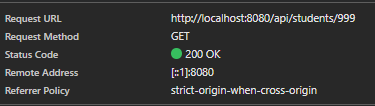

# Student management
## Thành viên nhóm
- Đỗ Minh Quân - 2212781
- Đặng Trần Công Chính - 2210387

## Hướng dẫn chạy

## Trả lời câu hỏi
## Lab 1

## Thêm dữ liệu lớn (ít nhất 10 sinh viên)

## Câu lệnh SQL

```sql
INSERT INTO Student(id, name, age, email) VALUES
(1, 'Nguyen Van A', 20, 'a@gmail.com'),
(2, 'Tran Thi B', 21, 'b@gmail.com'),
(3, 'Le Van C', 19, 'c@gmail.com'),
(4, 'Pham Thi D', 22, 'd@gmail.com'),
(5, 'Hoang Van E', 20, 'e@gmail.com'),
(6, 'Vo Thi F', 21, 'f@gmail.com'),
(7, 'Dang Van G', 20, 'g@gmail.com'),
(8, 'Bui Thi H', 23, 'h@gmail.com'),
(9, 'Do Van I', 19, 'i@gmail.com'),
(10, 'Phan Thi K', 22, 'k@gmail.com');
```
## Kết quả 
Thêm dữ liệu thành công

# Ràng buộc Primary Key

## Thử nghiệm
Cố tình insert một id đã tồn tại:

```sql
INSERT INTO Student(id, name, age, email)
VALUES (1, 'Duplicate Student', 20, 'dup@gmail.com');
```

## Thông báo lỗi

```
UNIQUE constraint failed: Student.id
```

## Giải thích

Primary Key có hai đặc tính quan trọng:

### 1. UNIQUE
- Mỗi id chỉ xuất hiện một lần
- Không cho phép trùng lặp
### 2. NOT NULL
- Không được để rỗng

#### Tại sao Database chặn thao tác này?

Nếu cho phép trùng id:
- Không phân biệt được hai sinh viên
- Query trả về nhiều kết quả sai
- UPDATE/DELETE có thể tác động nhầm dữ liệu
- Mất tính toàn vẹn dữ liệu

## Toàn vẹn dữ liệu (Constraints – NULL name)

### Thử nghiệm

```sql
INSERT INTO Student(id, name, age, email)
VALUES (11, NULL, 20, 'null@gmail.com');
```


### Do Không có NOT NULL
- Insert thành công
- name = NULL


## Ảnh hưởng khi đọc dữ liệu bằng Java

Ví dụ:

```java
String name = rs.getString("name");
System.out.println(name.length());
```

Nếu name = NULL:
- Gây NullPointerException
- Chương trình bị crash
- Lỗi runtime
- Giao diện hiển thị "null"


---

## Giải pháp đề xuất
- Thêm NOT NULL trong Database

```sql
name VARCHAR(100) NOT NULL
```

## Lab 2
### Test case 1
Kết quả trả về của api
```json
[
  {
    "age": 20,
    "email": "vana@example.com",
    "id": "1",
    "name": "Nguyen Van A"
  },
  {
    "age": 21,
    "email": "thib@example.com",
    "id": "2",
    "name": "Tran Thi B"
  }
]
```
### Test case 2
Kết quả trả về của api
```json
{
  "age": 20,
  "email": "vana@example.com",
  "id": "1",
  "name": "Nguyen Van A"
}
```
### Test case 3
Kết quả trả về

